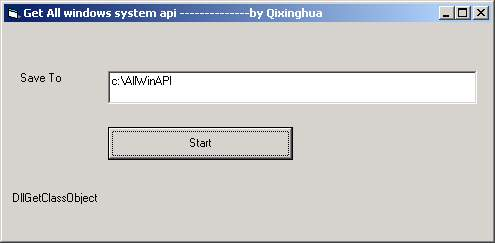



## get all these api functions from dll files

### Description

I have post an article ,that included all basic windows apis,recently i recieved many emails which said want to know how to get all these api functions from dll files ,so i post this code.
 
### More Info
 

             |
---                |---
**Submitted On**   |2003-07-28 22:05:02
**By**             |[Qi xinghua](https://github.com/Planet-Source-Code/PSCIndex/blob/master/ByAuthor/qi-xinghua.md)
**Level**          |Advanced
**User Rating**    |5.0 (15 globes from 3 users)
**Compatibility**  |VB 5\.0, VB 6\.0
**Category**       |[Windows API Call/ Explanation](https://github.com/Planet-Source-Code/PSCIndex/blob/master/ByCategory/windows-api-call-explanation__1-39.md)
**World**          |[Visual Basic](https://github.com/Planet-Source-Code/PSCIndex/blob/master/ByWorld/visual-basic.md)
**Archive File**   |[get\_all\_th1621107282003\.zip](https://github.com/Planet-Source-Code/qi-xinghua-get-all-these-api-functions-from-dll-files__1-47233/archive/master.zip)

